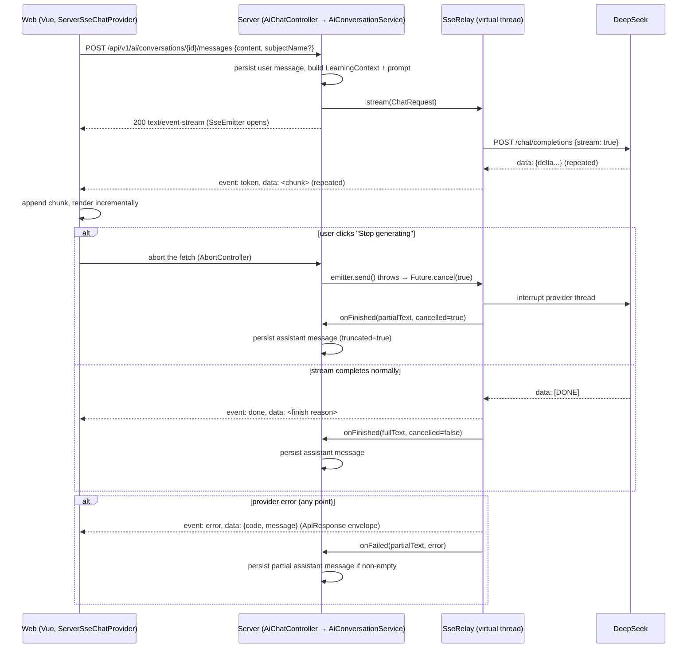

# AI Learning Engine (Phase 6)

Phase 6 deliverable. This document records how the `ai` backend package and
its frontend consumers are built — read `docs/architecture.md` first for the
engineering constitution (the `AiService` abstraction was reserved there
since Phase 1), and `docs/product-domain.md` for the workspace shell and
`ChatProvider` seam this phase plugs into.

Phase 5 built every AI-touching UI surface against a stable interface without
calling a real model. Phase 6 turns that seam real: a provider-abstracted AI
service backed by DeepSeek, true SSE token streaming, persisted conversations,
a context/prompt pipeline, and generation actions surfaced across AI Tutor,
Notes, Flashcards, Subjects and Analytics — a provider swap and a set of new
endpoints, not a UI rewrite.

## Package layout

Package-by-feature, matching every existing module:

```
ai/
  config/AiConfig.java             RestClient + virtual-thread executor beans
  provider/AiProvider.java         interface: id(), isConfigured(), chat(ChatRequest, ChatStreamListener)
  provider/DeepSeekProvider.java   OpenAI-compatible /chat/completions, SSE parsing, retry + error translation
  provider/dto/*                   DeepSeek wire DTOs (package-private)
  context/LearningContext.java     record: subject snapshot + material titles, note/flashcard counts, stats snapshot, focus content
  context/ContextHints.java        caller-supplied hints: a resolved subjectId (Phase 7) plus string fallbacks LearningContextService can't derive itself
  context/LearningContextService.java   builds LearningContext from userId (real note/flashcard data), resolves subjectId → subject/materials/notes server-side (Phase 7), falls back to string hints
  prompt/PromptTemplate.java       one system prompt per use-case (TUTOR, EXPLAIN, QUIZ, FLASHCARDS, STUDY_PLAN, SUMMARY, SUGGESTIONS, NOTE_*, WEAK_POINTS, WEEKLY_SUMMARY)
  prompt/PromptBuilder.java        renders template + context + history + input into the final message list; enforces maxPromptChars
  stream/SseRelay.java             drives AiProvider.chat on a virtual thread, relays tokens to SseEmitter, handles cancellation
  stream/RelayCallback.java        onFinished/onFailed — lets the caller persist whatever text actually streamed
  entity/AiConversation.java, entity/AiMessage.java, entity/AiMessageRole.java
  mapper/AiConversationMapper.java, mapper/AiMessageMapper.java
  service/AiConversationService.java   conversation CRUD + "send message → stream reply → persist" orchestration
  service/AiGenerationService.java     one-shot use-cases: explain/summary/suggestions/quiz/flashcards/study-plan/note-actions/weekly-summary/weak-points
  controller/AiChatController.java     /api/v1/ai/conversations (CRUD) + POST .../{id}/messages (text/event-stream)
  controller/AiGenerationController.java   /api/v1/ai/generate/*, /api/v1/ai/notes/actions, /api/v1/ai/analytics/*
  dto/*                             request/response records, one per endpoint
  exception/AiErrorCode.java        190000–199999
  util/PromptSizeGuard.java         char-length check shared by PromptBuilder
```

Frontend: `api/modules/ai.ts` (typed conversation CRUD + generation calls),
`features/ai-tutor/provider.ts` (`ChatProvider` interface +
`ServerSseChatProvider`, the real implementation that replaced Phase 5's
`MockChatProvider`).

## Provider abstraction

```java
public interface AiProvider {
    String id();
    boolean isConfigured();
    void chat(ChatRequest request, ChatStreamListener listener);
}
```

`DeepSeekProvider` is the only implementation today, registered as the
`AiProvider` bean. Every other package in `ai/` — prompt building, context
assembly, conversation persistence, generation parsing — depends only on this
interface, never on DeepSeek's wire format. Swapping in another vendor (Tongyi,
Doubao, Kimi, OpenAI, Claude, Gemini, a local Ollama model) means adding a new
`AiProvider` implementation and flipping `app.ai.provider`; nothing above the
provider layer changes.

`isConfigured()` backs **lazy, non-startup-fatal validation**: a blank
`DEEPSEEK_API_KEY` doesn't stop the app from booting — every other feature
keeps working, and the first AI call simply returns
`PROVIDER_NOT_CONFIGURED` (503) instead of a stack trace.

### DeepSeek integration

DeepSeek exposes an OpenAI-compatible `POST /chat/completions`. Every call
requests `"stream": true`, including one-shot generation use-cases —
`AiGenerationService` gets its "single answer" by having its
`ChatStreamListener` concatenate tokens instead of the provider running a
separate non-streaming code path, so there is exactly one request shape to
maintain.

- **Retries** (bounded, exponential backoff, 3 attempts) apply only to
  failures *before* the first token is emitted — a connection refusal or a
  5xx before any bytes arrive. Once tokens have started flowing, a failure is
  reported as `STREAM_INTERRUPTED` and never retried, since retrying would
  duplicate content the client already rendered.
- **HTTP status → error code** translation: `401/403` → `PROVIDER_AUTH_FAILED`,
  `429` → `RATE_LIMITED`, `402` → `QUOTA_EXCEEDED`, `400/404` →
  `INVALID_MODEL`, everything else → `PROVIDER_UNAVAILABLE` (5xx is retryable,
  the rest aren't).
- **SSE line parsing**: DeepSeek's stream is `data: {...}\n\n` frames ending
  in `data: [DONE]`. `DeepSeekProvider` reads line-by-line, skips blank/non-
  `data:` lines, parses each JSON chunk, and forwards `delta.content` to the
  listener; a `finish_reason` on any chunk or the `[DONE]` sentinel ends the
  call. Malformed chunks are logged and skipped rather than failing the whole
  stream.

## Streaming mechanics

The servlet stack (`spring-boot-starter-webmvc`) was kept as-is — no
WebFlux/reactive stack was added. Two pieces make streaming work without it:

1. **Outbound (server → DeepSeek)**: a `RestClient` built on
   `JdkClientHttpRequestFactory`, wrapping a single connection-pooled
   `java.net.http.HttpClient` (`AiConfig#aiRestClient`). This exposes the
   response body as a live `InputStream` instead of buffering the whole
   response, which is what lets `DeepSeekProvider` relay tokens as they
   arrive rather than waiting for DeepSeek to finish.
2. **Inbound (server → browser)**: a `SseEmitter` (5 minute timeout) driven
   from a virtual thread (`AiConfig#aiStreamingExecutor`,
   `spring.threads.virtual.enabled: true`). `SseRelay` is the only class that
   touches `SseEmitter` — it submits `AiProvider.chat(...)` to the executor
   and forwards `onToken`/`onComplete`/`onError` as `token`/`done`/`error` SSE
   events. Holding a virtual thread open for a slow model response is cheap,
   so one open connection per in-flight generation costs nothing a platform
   thread wouldn't be needed for anyway.

**Cancellation**: a client abort (browser closes the connection, or the user
clicks "Stop generating") makes the next `emitter.send()` throw, which cancels
the backing `Future` and interrupts the provider thread. `DeepSeekProvider`
checks `Thread.interrupted()` between reads of the upstream stream and between
retry attempts, so an interrupt unblocks it at the next line read — a stalled
connection with literally no further bytes won't unblock instantly, an
accepted tradeoff rather than reaching for lower-level socket control.
Whatever text streamed before the cancel is still persisted (`truncated =
true` on the message row), so the user never loses a partial answer.

## Context pipeline

```java
public record ContextHints(Long subjectId, String subjectName,
        String subjectDescription, String statsSnapshot,
        String focusLabel, String focusContent)

public record LearningContext(String subjectName, String subjectDescription,
        List<String> subjectMaterialTitles,
        int totalNotes, List<String> recentNoteTitles,
        int totalFlashcardDecks, int totalFlashcards, int dueFlashcards,
        String statsSnapshot, String focusLabel, String focusContent)
```

`LearningContextService.build(userId, hints)` assembles a `LearningContext`
from two sources:

- **Real, server-resolved data** — recent note titles and flashcard/deck
  counts, queried from `NoteMapper`/`FlashcardDeckMapper`/`FlashcardMapper`,
  scoped to `userId`. Since Phase 7, `hints.subjectId()` — a *resolved,
  ownership-validated* id the caller obtained via
  `SubjectService.resolveOwnedSubject*()` — additionally pulls the subject's
  real name/description, its material titles (up to 10, newest first), and
  scopes the note count/titles to that subject. A stale id (subject deleted
  since it was persisted on a conversation) degrades gracefully to the string
  hints instead of failing the chat.
- **Caller-supplied hints** — subject name/description (fallback when no
  subject id is present — legacy clients and the generation endpoints), an
  analytics stats snapshot, and "focus content" (e.g. the note text a
  rewrite/explain action is operating on). The caller is responsible for
  having already fetched and ownership-checked whatever it passes as
  `focusContent`; `LearningContext` never fetches it itself.

`PromptBuilder` renders the non-empty parts of a `LearningContext` into a
`## 学习背景` block appended to the template's system prompt, then prepends
conversation history and the current user input — every AI use-case (chat and
one-shot generation alike) goes through this one method, so no controller or
service ever concatenates a prompt string itself.

### Phase 6 limitation, closed in Phase 7: server-side subject resolution

Phase 6 shipped with subjects living only in frontend mocks, so every AI
action sent the subject's `name`/`description` as plain client-supplied text.
Phase 7 closed that boundary: Subject CRUD is real, `ai_conversations` gained
a nullable `subject_id` logical FK (V5), and the chat endpoints accept a
`subjectId`:

- `POST /ai/conversations` and `POST /ai/conversations/{id}/messages` take an
  optional `subjectId` (string wire id). It must reference a subject owned by
  the caller (`SubjectService.resolveOwnedSubject`, same 110000/110001 errors
  as everywhere else) and is persisted on the conversation, with
  `subject_name` refreshed as a display snapshot from the real subject.
  Per the partial-update convention, `null` keeps the current link and
  `""` clears it; on later sends the conversation's stored link supplies the
  context without the client resending it.
- `LearningContextService` resolves the id to the subject's real
  name/description/material titles and subject-scoped notes (see above).
- **String hints remain supported**: requests without a `subjectId` behave
  exactly as in Phase 6 — hint-only chat and all generation endpoints
  (`statsSnapshot`, Subject-page text context) still work unchanged.

`subject_name` is kept deliberately (not retired) so conversation lists stay
readable after a subject is renamed or deleted — subject deletion nullifies
`subject_id` (Phase 7 cascade in `SubjectService.delete`) but leaves the
snapshot.

## Prompt system

One `PromptTemplate` enum entry per use-case — the *only* place a system
prompt string is written. Two shapes:

- **Free text** (`TUTOR`, `EXPLAIN`, `SUMMARY`, `SUGGESTIONS`, the `NOTE_*`
  rewrite family, `WEAK_POINTS`, `WEEKLY_SUMMARY`) — the model's reply is
  used as-is.
- **Structured JSON** (`QUIZ`, `FLASHCARDS`, `STUDY_PLAN`,
  `structuredJson() == true`) — the prompt documents an exact JSON shape
  inline (e.g. `{"questions":[{"question":...,"options":[...],"answer":...,
  "explanation":...}]}`), and `AiGenerationService` parses the response with
  Jackson into a typed DTO. `stripCodeFence()` first strips a
  ` ```json ... ``` ` wrapper if the model added one despite being told not
  to; a parse failure surfaces as `GENERATION_PARSE_FAILED` (500), not a
  silent empty result.

Prompts are written in Chinese — the product targets Chinese users and
DeepSeek is the default provider — but `TUTOR`'s prompt explicitly instructs
the model to answer in whatever language the user wrote in.

Since Phase 15 the `FLASHCARDS` prompt no longer just asks for "concise
cards": it encodes the spaced-repetition rules that make a card *schedulable* —
atomicity (one fact per card; compound content is split into several cards),
answer-side brevity (the back is the single fact, not an explanation),
self-contained questions, no list-answers, and language-matching — because the
generated deck now flows straight into the real FSRS scheduler (Phase 15
review engine), where low-quality cards cannot be reviewed effectively. The
JSON wire shape (`{"cards":[{"front":...,"back":...}]}`) is unchanged, so the
`FlashcardsWire` parse path is untouched; `PromptTemplateTest` guards both the
shape and the quality directives against regression.

## Conversation flow (AI Tutor)

`AiConversationService` owns conversation CRUD (list/create/rename/archive/
delete, all ownership-checked against `userId`) plus the send-message
use-case:

1. Persist the user's message.
2. If this is the conversation's first message, derive a title from it (first
   24 chars + `…`).
3. Resolve the optional `subjectId` (persisting the link and refreshing the
   `subjectName` snapshot), then build `LearningContext` from the
   conversation's subject link — or the client-supplied `subjectName`/
   `subjectDescription` fallback — plus real note/flashcard counts (chat has
   no note/flashcard "focus"; that's the generation endpoints' job).
4. `PromptBuilder.build(TUTOR, context, history, null)` — history is the
   full prior message list, mapped to `ChatTurn`s.
5. Hand the message list to `SseRelay.stream(...)`, whose `RelayCallback`
   persists the assistant's reply (or partial reply, if cancelled/failed)
   once the stream ends.

### Streaming send flow (sequence)



Event names on the wire: `token` (data = raw text delta), `done` (data =
finish reason), `error` (data = the standard `ApiResponse` failure envelope,
so the frontend can key off the same numeric error codes as regular REST
calls).

## Non-chat generation

`AiGenerationService` covers every one-shot use-case behind
`/api/v1/ai/generate/*`, `/api/v1/ai/notes/actions` and
`/api/v1/ai/analytics/*`:

| Endpoint | Template | Notes |
| --- | --- | --- |
| `POST /generate/explain` | `EXPLAIN` | `topic` required |
| `POST /generate/summary` | `SUMMARY` | `text` required (the content to summarize) |
| `POST /generate/suggestions` | `SUGGESTIONS` | subject context only |
| `POST /generate/quiz` | `QUIZ` (structured) | parses into `QuizResponse` |
| `POST /generate/flashcards` | `FLASHCARDS` (structured) | parses into cards, then **persists** a real deck via `FlashcardService.createDeckFromGenerated` — this is the one generation endpoint with a side effect beyond returning text |
| `POST /generate/study-plan` | `STUDY_PLAN` (structured) | `goal` + `availableMinutesPerDay` required; parses into `StudyPlanResponse` |
| `POST /notes/actions` | one of the `NOTE_*` templates, selected by `NoteActionRequest.action()` | operates on `text` (a note's content or a selection within it) |
| `POST /analytics/weekly-summary` | `WEEKLY_SUMMARY` | `statsSnapshot` is a client-composed text blob (see the Subjects/Analytics scoping note above) |
| `POST /analytics/weak-points` | `WEAK_POINTS` | same `statsSnapshot` contract |

Every one-shot call runs through the same `generateRaw()` helper: build
context → build prompt → run `aiProvider.chat()` synchronously (accumulating
tokens instead of streaming them to the client) → return the text, or throw
if the provider reported an error or returned nothing. Structured endpoints
additionally run the result through `parseJson()`.

## Frontend integration

- **`api/modules/ai.ts`** — typed conversation CRUD and every generation call,
  through `api/http.ts`'s existing `unwrap`/`ApiError` pattern. This is the
  only file that knows the AI endpoint URLs; every view calls through it.
- **`ChatProvider` / `ServerSseChatProvider`** (`features/ai-tutor/provider.ts`)
  — the seam `docs/product-domain.md` reserved in Phase 5. Same
  `streamReply(history): AsyncGenerator<string>` shape as the old
  `MockChatProvider`, so `AiTutorView.vue`'s control flow didn't change shape,
  only its data source. Internally: `fetch()` + `ReadableStream` (axios can't
  expose a live stream for a POST body), manual SSE frame parsing
  (`parseSseStream`), an `AbortController` wired to `cancel()`, and a 401 path
  that reuses `api/http.ts`'s single-flight refresh (`refreshTokenAfterUnauthorized`)
  before retrying once.
- **AI Tutor** (`AiTutorView.vue`) — real conversation list/create/rename/
  archive/delete; sending a message creates a conversation on first send if
  none is active, then opens the stream.
- **Notes** (`NotesView.vue`) — an AI toolbar (explain/rewrite/continue/
  simplify/expand/translate/summarize/generate-flashcards) operating on the
  selected text (or the whole note if nothing is selected), applying results
  back into the editor via an `AppDialog` confirmation step.
- **Flashcards** (`FlashcardsView.vue`) — real deck/card CRUD; AI-generated
  decks from Notes/Subjects/the conversation flow appear here immediately
  since they're persisted through the same `FlashcardService`.
- **Subjects** (`SubjectDetailView.vue`) — an AI actions row (Ask AI, Generate
  Summary/Quiz/Flashcards/Study Plan, Explain Knowledge, Learning
  Suggestions), each sending the mock subject's name/description (plus
  material titles, for summary/quiz/flashcards) as the client-supplied
  context described above. "Ask AI" creates a real AI Tutor conversation
  seeded with `subjectName` and navigates there — no separate chat
  implementation.
- **Analytics** (`AnalyticsView.vue`) — an "AI insights" panel calling
  `generateWeeklySummary`/`generateWeakPoints` with a client-composed stats
  snapshot string, rendered as two text blocks.

No view builds its own prompt string or duplicates a template — every AI
surface is a thin caller of `api/modules/ai.ts`.

## Configuration

Bound at `app.ai.*` via `AppProperties.Ai`:

```yaml
app:
  ai:
    provider: deepseek
    max-prompt-chars: 24000
    deepseek:
      api-key: ${DEEPSEEK_API_KEY:}   # secret — environment only, never hardcoded, never logged
      base-url: https://api.deepseek.com
      model: deepseek-chat
      temperature: 0.7
      top-p: 0.95
      max-tokens: 2048
      timeout: 60s
      streaming-enabled: true
```

`dev` and `prod` profiles both inherit this block unmodified — the only thing
that differs between environments is whether `DEEPSEEK_API_KEY` is set in the
environment. A blank key means every AI endpoint returns
`PROVIDER_NOT_CONFIGURED` (503); nothing else in the app is affected.

## Database

`V3__create_ai_conversation_tables.sql` — same conventions as V1/V2 (snowflake
ids, audit + logical-delete columns, indexed logical FKs, `utf8mb4_unicode_ci`):

- **`ai_conversations`**: `user_id`, `title`, `subject_id` (nullable logical
  FK, added by V5 in Phase 7), `subject_name` (nullable display snapshot —
  see the subject-resolution note above), `archived`.
- **`ai_messages`**: `conversation_id`, `user_id` (denormalized, so per-user
  queries need no join), `role` (0=user, 1=assistant, 2=system), `content`
  (`MEDIUMTEXT`), `truncated` (set when a reply was cut short by cancellation
  or a mid-stream failure).

## Error codes (190000–199999)

| Code | Meaning | HTTP |
| --- | --- | --- |
| 190000 | Provider not configured (`DEEPSEEK_API_KEY` blank) | 503 |
| 190001 | Provider unavailable / network error | 502 |
| 190002 | Provider timeout | 504 |
| 190003 | Provider rejected the API key | 502 |
| 190004 | Rate limited | 429 |
| 190005 | Quota exceeded | 402 |
| 190006 | Invalid model | 400 |
| 190007 | Stream interrupted (after tokens had started) | 500 |
| 190008 | Context/prompt too large | 400 |
| 190009 | Generation output failed to parse | 500 |
| 190010 | Conversation not found | 404 |
| 190011 | Conversation access denied (not owner) | 403 |

All funnel through the existing `GlobalExceptionHandler` via
`BusinessException`, same envelope and i18n-message-key pattern as every other
module's error codes.

## Security

- API key lives only in `DEEPSEEK_API_KEY` (environment), never in a YAML
  file or a log line — `AppProperties.Ai.DeepSeek.apiKey()`'s Javadoc says so
  explicitly, and no log statement in `DeepSeekProvider` prints the request
  body (only status codes and a truncated error body).
- Every conversation read/write is ownership-checked (`requireOwned`) against
  the authenticated `userId` before any query — the same pattern
  `AuthService`/`NoteService`/`FlashcardService` use.
- `PromptSizeGuard` rejects an oversized prompt (`CONTEXT_TOO_LARGE`, 400)
  before it's ever sent to DeepSeek, bounding both cost and the blast radius
  of a pathological client payload.
- All AI endpoints require an authenticated session — no anonymous access to
  any `/api/v1/ai/*` route.

## Performance

- One shared, connection-pooled `HttpClient` for every outbound DeepSeek
  call — no per-request client construction.
- Streaming end-to-end (DeepSeek → server → browser) means the user sees the
  first token as soon as DeepSeek emits it, not after the full completion.
- Virtual threads make holding a connection open for a slow model response
  cheap; `spring.threads.virtual.enabled: true` applies the same tradeoff to
  the servlet container generally.
- One-shot generation calls (`AiGenerationService`) still request
  `stream: true` from DeepSeek internally (one request shape to maintain) but
  accumulate before returning — the client gets one response, not partial
  JSON it would have to buffer itself before parsing.

## Extending to another provider

Adding a second model provider (Tongyi, Doubao, Kimi, OpenAI, Claude, Gemini,
a local Ollama model) means:

1. Implement `AiProvider` (`id()`, `isConfigured()`, `chat(...)`) — wire
   parsing is provider-specific and stays inside the new class, mirroring how
   `DeepSeekProvider`'s wire DTOs are package-private to `provider.dto`.
2. Add the provider's config block under `app.ai.*` (`AppProperties.Ai` gains
   a sibling record next to `DeepSeek`).
3. Register the bean and select it via `app.ai.provider`.

Nothing in `context/`, `prompt/`, `stream/`, either service, either
controller, or any frontend file changes — that's the point of the seam.

## What the next phase finds waiting for it

- ~~Real Subject/Task CRUD … `subjectId`-based context lookup~~ — **done in
  Phase 7**: `LearningContextService` resolves subjects server-side and
  `ai_conversations.subject_id` is a real logical FK (see the
  subject-resolution section). What remains open on that path is the
  frontend sending `subjectId` from a real subject picker (Phase 7 frontend
  steps) and eventually extending `subjectId` to the one-shot generation
  DTOs, which still use string hints by design.
- A spaced-repetition review engine (flashcard `due_at`/`interval_days`/`ease`
  columns already exist, reserved since Phase 5) would let Analytics' stats
  snapshot include real review data instead of the mock numbers it composes
  today.
- `docs/architecture.md`'s reserved-but-unimplemented list (Redis, OSS,
  WebSocket, Elasticsearch, MQ, scheduler, audit log) is unaffected by this
  phase — none of them were needed for a stateless HTTP/SSE integration.
