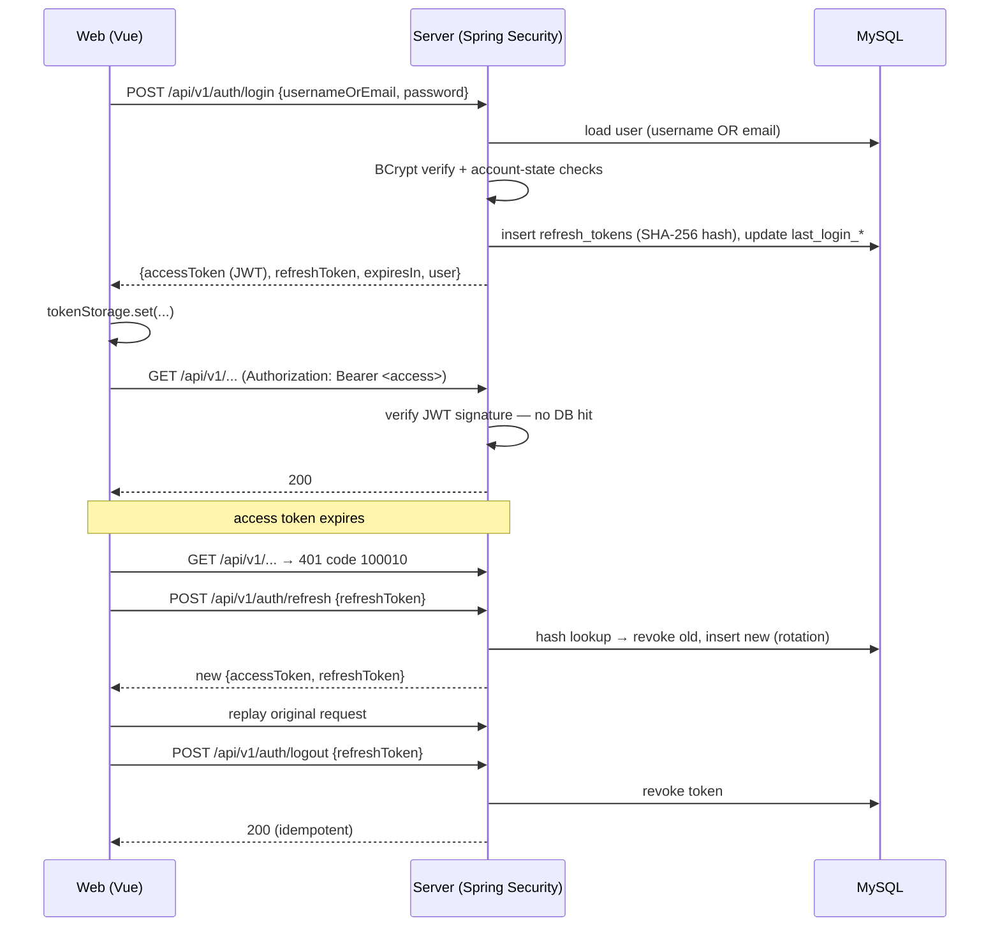

# Architecture & Engineering Constitution

Decisions recorded here are binding until explicitly revised. When adding code,
match these conventions — do not invent parallel ones.

## Product positioning

An **AI-native learning workspace** (not an educational admin system). Commercial
SaaS quality is the bar. UI language: modern, premium, minimal — in the spirit of
Apple, Linear, Notion, Raycast, Vercel, Stripe.

## Confirmed platform decisions (2026-07)

| Topic | Decision |
| --- | --- |
| Java | 22 — use modern language features (records, pattern matching, virtual threads where useful) |
| Repository | Single monorepo: `github.com/YukaKaori/AI-Learning-Platform` |
| Migrations | Flyway only; production schema is never changed manually |
| i18n | i18n-ready from day one; default `zh-CN`, fallback `en-US`; no hard-coded UI text |
| Frameworks | Spring Boot 4 / Vue 3 + TS + Vite / Pinia / Element Plus (themed) / MyBatis-Plus / MySQL |

## Backend

**Style: modular monolith, package-by-feature.** Each feature owns
`controller / service / mapper / entity / dto` under its package. Cross-cutting
code lives in `common/`; framework wiring in `config/`.

### Conventions

- **API prefix**: `/api/v1/...`. Controllers return `ApiResponse<T>`; DTOs are records.
- **Envelope**: `{ code, message, data, timestamp }`; `code = 0` means success.
  HTTP status still carries transport semantics (400/401/404/500…).
- **Errors**: services throw `BusinessException(ErrorCode)`. Only
  `GlobalExceptionHandler` builds error responses. Error-code ranges:
  40000–49999 common client, 50000–59999 common server, then 10000 per feature
  module starting at 100000 — auth 100000, subject 110000, material 120000,
  note 130000, flashcard 140000, task 150000, calendar 160000,
  workspace 170000 (reserved — pure façade, composes other modules' errors,
  owns no codes of its own), analytics 180000, ai 190000, preferences 200000.
  See § Phase 7 for the full per-module code list.
- **Entities** extend `BaseEntity` (snowflake id, `created_at`, `updated_at`,
  `deleted`); audit fields are filled automatically. Entities never cross the API
  boundary — map to DTOs.
- **Validation**: Bean Validation annotations on request DTOs; no manual checks in
  controllers.
- **Configuration**: YAML per profile (`dev` default, `prod`); all custom settings
  under `app.*` bound via `AppProperties`. Secrets only from environment variables.

### External-service abstraction (mandatory)

Business code never talks to a vendor SDK directly. Define the interface in
`infrastructure/` when the capability is first needed:

- `StorageService` → Aliyun OSS / MinIO / S3 / local
- AI abstraction → Claude / OpenAI / Gemini / DeepSeek / local models
  (provider implementations + configuration layer + conversation management).
  Landed in Phase 6 as `ai/provider/AiProvider.java` (feature-package-local,
  not `infrastructure/` — the interface has no callers outside the `ai`
  package) with `DeepSeekProvider` as the sole implementation; see
  `docs/ai-engine.md`.
- `NotificationService`, cache, search, MQ — same pattern.

Reserved (do not implement early): Redis, OSS, WebSocket, Elasticsearch, MQ,
scheduler, audit log.

## Frontend

**Structure**: `api/` (axios + typed endpoint modules) · `components/` (design-system)
· `composables/` · `layouts/` · `locales/` · `router/` · `stores/` · `styles/` ·
`views/` (grow into `features/` when modules appear).

### Conventions

- **Design tokens first**: every color/spacing/radius/shadow comes from
  `styles/tokens.css`. Element Plus is bridged to the tokens in
  `styles/element-theme.css` — never style against EP defaults.
- **Dark mode**: `html.dark` class, three-way preference (light/dark/system) in the
  app store.
- **i18n**: all user-visible text through vue-i18n keys; `en-US` must mirror
  `zh-CN` key-for-key (enforced by unit test).
- **HTTP**: all requests go through `api/http.ts` helpers, which unwrap the
  envelope and normalize failures to `ApiError` (with i18n message key).
- **Element Plus**: on-demand via unplugin resolvers; prefer custom token-based
  components for signature surfaces, EP for complex primitives (tables, pickers).

## Design system (Phase 3)

Full reference: `docs/design-system.md`. Binding conventions only, here:

- **Tokens are the only source of visual values.** `styles/tokens.css` defines the base
  scales (typography, color, spacing, radius, shadow, motion, glass); `styles/motion.css`
  holds transition/keyframe tokens. Components never hard-code a color, size, or timing.
- **Component split**: signature surfaces (`AppButton`, `AppInput`, `AppCard`,
  `AppAvatar`, `AppTag`, `AppBadge`, `AppEmpty`, `AppLoading`, `AppSkeleton`,
  `AppSection`, `AppPageHeader`, `AppSearch`) are custom-built from tokens. Complex
  primitives with real positioning/focus-trap logic (`AppDialog`, `AppDrawer`,
  `AppTooltip`, `AppPagination`) are themed wrappers over Element Plus — do not
  reimplement that logic from scratch.
- **Icons**: only `AppIcon` may import from the underlying icon library
  (`lucide-vue-next`). Application code never imports icon components directly — this
  keeps the icon set swappable.
- **Registration**: `src/components/` exports are explicit (`src/components/index.ts`
  barrel) — no auto-import for app components, matching the existing
  `unplugin-vue-components` config which is scoped to Element Plus only.
- **Theme engine**: `stores/app.ts` owns `light` / `dark` / `system`, persisted, applied
  via the `html.dark` class. A `glass` mode is a reserved extension point (tokens exist
  in `tokens.css`; no toggle yet).
- **Glass theme, full component skinning, and the premium login** are reserved for
  Phase 4+ — this phase only prepares the tokens.

## Database

See `database/README.md`: snake_case, utf8mb4, mandatory audit columns, logical
foreign keys, migration-only changes.

## Identity & security (Phase 2)

### Architecture

Stateless authentication with a two-token model:

- **Access token** — self-contained HS256 JWT (jjwt), 30 min TTL. Validated by
  signature only; no database lookup per request. Claims: `sub` (user id),
  `username`, `iss`, `iat`, `exp`, `jti`.
- **Refresh token** — opaque 256-bit random value, 14 day TTL. Stored **hashed**
  (SHA-256) in `refresh_tokens`; the raw value exists only on the client.

Key classes: `TokenService` (abstraction — the only seam token consumers see;
`JwtTokenService` is the jjwt/MySQL implementation), `JwtAuthenticationFilter`
(bearer-token authentication), `SecurityConfig` (filter chain),
`DbUserDetailsService` + `UserPrincipal` (password login path via
`AuthenticationManager`), `AuthService`/`AuthController` (use-cases + REST).

### Refresh-token rotation & reuse detection

Every `/auth/refresh` **rotates**: the presented token is revoked
(`revoked_at`), a new one is issued, and the two are linked (`replaced_by_id`).
Presenting an already-revoked token is treated as theft: **every live token of
that user is revoked** and the request fails with `REFRESH_TOKEN_REUSED`.
Logout revokes the presented token and is idempotent.

### JWT lifecycle

```
issue (login)          → HS256-signed, exp = now + access-token-ttl
validate (per request) → signature + iss + exp checked in JwtAuthenticationFilter
expire                 → 100010 TOKEN_EXPIRED → frontend silently refreshes
```

Signing key: `app.security.jwt.secret` (env `JWT_SECRET`, ≥ 32 bytes — the
application refuses to start otherwise).

### Login flow (sequence)



### Security decisions

| Decision | Rationale |
| --- | --- |
| CSRF disabled | Pure bearer-token API — no cookie-based session to forge |
| CORS via `CorsConfigurationSource` bean | Security's CorsFilter runs before auth: 401s carry CORS headers, preflights need no token |
| Refresh tokens hashed at rest | A leaked DB dump cannot be replayed |
| Login error is always `INVALID_CREDENTIALS` for bad user *or* bad password | No account enumeration |
| Errors funnel through `GlobalExceptionHandler` | Entry point / denied handler delegate via `HandlerExceptionResolver` — one envelope builder |
| Snowflake ids serialized as strings in DTOs | Exceed JS safe-integer range |
| `@EnableMethodSecurity` on now | RBAC phase adopts `@PreAuthorize` without config changes |

Extension points reserved (schema and/or seams exist, no implementation):
RBAC (`roles`/`permissions` tables + empty authorities in `UserPrincipal`),
OAuth2/third-party login and MFA (additional issuance paths behind
`TokenService`), email verification & password reset (account-state +
`app.security.password-policy` config), "sign out everywhere"
(`TokenService.revokeAllForUser`).

### Auth error codes (100000–109999)

| Code | Meaning | HTTP |
| --- | --- | --- |
| 100000 | Invalid credentials | 401 |
| 100001 | Account locked | 403 |
| 100002 | Account disabled | 403 |
| 100010 | Access token expired | 401 |
| 100011 | Access token invalid | 401 |
| 100020 | Refresh token invalid | 401 |
| 100021 | Refresh token expired | 401 |
| 100022 | Refresh token reused (rotation violation) | 401 |

### Frontend auth infrastructure

- `api/token-storage.ts` — sole owner of token persistence (localStorage today;
  designed to swap to httpOnly-cookie refresh + in-memory access token later).
- `api/http.ts` — attaches `Authorization`; on 401 performs a **single-flight**
  refresh and replays the failed request; unrecoverable sessions trigger the
  handler registered by the router (redirect to `/login`).
- `stores/auth.ts` — user identity + login/logout/session-restore actions.
- `router/guards.ts` — `requiresAuth` / `guestOnly` meta flags enforced in
  `beforeEach`; `roles`/`permissions` meta reserved for the RBAC phase.

## Roadmap

1. **Phase 1 — Foundation** ✅: plumbing, standards, initial design tokens, zero business features.
2. **Phase 2 — Identity** ✅: Spring Security 7 + JWT (access/refresh), user schema (V1 migration), frontend auth flow + route guards.
3. **Phase 3 — Enterprise design system** ✅: full token architecture (typography, color,
   spacing, radius, shadow, motion, glass prep), the `AppX` component library, icon
   abstraction (`AppIcon` over lucide), layout system (header/sidebar/content,
   responsive), accessibility baseline, `docs/design-system.md`. No business modules, no
   AI, no login redesign.
4. **Phase 4 — Premium authentication & signature welcome experience** ✅: the login +
   post-auth welcome screens that give the platform its first impression, built on the
   Phase 2 auth logic (unchanged) and Phase 3 tokens. See `docs/authentication-experience.md`.
5. **Phase 5 — AI-native workspace shell & product domain** ✅: the full domain model
   (Subject/Note/FlashcardDeck+Flashcard/LearningTask/StudySession) and every product
   module (Workspace, Subjects, AI Tutor, Flashcards, Notes, Calendar, Analytics,
   Profile, Settings) built with realistic mock data and a real (empty) backend schema
   (V2 migration). AI Tutor ships as a fully real chat UI wired to a swappable
   `ChatProvider`, streaming a canned reply — the seam Phase 6 fills in. See
   `docs/product-domain.md`.
6. **Phase 6 — AI learning engine (DeepSeek integration)** ✅: the `ai` backend package
   (`AiProvider`/`DeepSeekProvider`, true SSE token streaming over `RestClient` +
   virtual threads, persisted conversations, the context/prompt pipeline), real CRUD
   for Notes and Flashcards, and AI actions surfaced across AI Tutor, Notes, Flashcards,
   Subjects and Analytics. Subjects/Tasks stay mock-data-only this phase — AI context
   for them is client-supplied, not resolved server-side. See `docs/ai-engine.md`.
7. **Phase 7 — Commercial Product Foundation** ✅: real per-user Subject/Material/
   Task/Calendar/Preferences CRUD (V4/V5 migrations), the `subject` domain wired
   through Notes/Flashcards/AI Tutor, real Workspace/Analytics read models
   replacing every mock, the dark theme's black+purple luxury re-skin, and a
   UX unification pass. All 8 `features/*/mock.ts` files deleted. See
   § Phase 7 below and `docs/product-domain.md`, `docs/mock-migration.md`,
   `docs/phase7-delivery-report.md`.
8. **Phase 8** (not yet scoped): candidate areas noted in
   `docs/phase7-final-report.md`'s "Recommended Phase 8 scope" — registration/
   email/password-reset, OSS file upload, spaced-repetition review engine,
   production ops (Docker/CI/CD/observability). Not decided; a dedicated
   planning session picks the actual scope.

## Phase 7 — Commercial Product Foundation

Turned the Phase 5 mock-data shell into a real, per-user-isolated SaaS product.
Full design rationale (D1–D10) lives in the phase plan; this section records
what's binding going forward. Detailed module docs: `docs/product-domain.md`
(domain model, module responsibilities), `docs/mock-migration.md` (what
replaced each deleted mock), `docs/ai-engine.md` § subject-resolution (AI
`subjectId` flow), `docs/design-system.md` (dark theme identity, view-state
pattern, `StatTile`).

### New/changed modules and error-code ranges

| Range | Module | Notes |
| --- | --- | --- |
| 110000–119999 | `subject` | `SUBJECT_NOT_FOUND`, `SUBJECT_ACCESS_DENIED`, `SUBJECT_STATUS_INVALID` |
| 120000–129999 | `material` | `MATERIAL_NOT_FOUND`, `MATERIAL_ACCESS_DENIED`, `MATERIAL_TYPE_INVALID` |
| 150000–159999 | `task` | `TASK_NOT_FOUND`, `TASK_ACCESS_DENIED`, `TASK_STATUS_INVALID`, `TASK_PRIORITY_INVALID` |
| 160000–169999 | `calendar` | `SESSION_NOT_FOUND`, `SESSION_ACCESS_DENIED`, `SESSION_TIME_INVALID`, `SESSION_WINDOW_INVALID` |
| 170000–179999 | `workspace` | reserved, unused — `GET /v1/workspace/summary` is a pure façade over subject/task/calendar/analytics services and surfaces *their* error codes, never its own |
| 180000–189999 | `analytics` | `ANALYTICS_RANGE_INVALID` (the only validation surface — window must be 1–90 days) |
| 200000–209999 | `preferences` | `PREFERENCE_THEME_INVALID`, `PREFERENCE_LOCALE_INVALID` |

`ai` (190000–199999) gained no new codes this phase; see `docs/ai-engine.md`
for its full table (unchanged since Phase 6, `subject_id` resolution reuses
`subject`'s own codes, not new ones).

### D1 — `OwnershipGuard`

`common/OwnershipGuard.require(entity, ownerFn, userId, notFoundCode,
deniedCode)` is the single ownership check every user-scoped module calls
after a primary-key load: `null` → `notFoundCode`, owner mismatch →
`deniedCode`, otherwise the entity is returned non-null and confirmed owned.
Introduced this phase to replace eight copies of the same branch across
`note`/`flashcard`/`ai` (retrofitted, behavior-neutral) and every new Phase 7
service (`subject`, `material`, `task`, `calendar`). New user-scoped modules
call this instead of writing the check inline.

### D2 — Subject delete cascade

`SubjectService.delete` is `@Transactional` and, in order: **soft-deletes**
the subject's materials (`MaterialMapper.delete(...)` — `LearningMaterial`
extends `BaseEntity`, whose `deleted` column is `@TableLogic`, so MyBatis-Plus
turns this into an `UPDATE ... SET deleted = 1`, not a physical `DELETE`),
then **nullifies** `subject_id` on every note/deck/task/session/conversation
that referenced it, then hard-deletes the subject row itself. Rationale:
materials have no existence independent of their subject (existentially
owned — soft-delete matches every other module's logical-delete convention);
notes/decks/tasks/sessions/conversations are user-authored content that
exists independently of any subject link (nullable by design since Phase 5) —
deleting a subject must never destroy them. The delete confirmation dialog
states this distinction explicitly rather than leaving it implicit.

### Read-model contracts (Workspace, Analytics)

Both packages own **zero tables** — `GET /v1/workspace/summary` and the three
`GET /v1/analytics/*` endpoints aggregate existing tables
(`subjects`/`learning_materials`/`learning_tasks`/`study_sessions`/`notes`/
`flashcard_decks`/`flashcards`/`ai_conversations`) with column-projected SQL,
scoped to the authenticated user, computed on every request — no
materialization, no cache. `weekDeltaPercent` and similar week-over-week
metrics are **nullable**, rendered as `—` rather than `0`, when the prior
week has no baseline to compare against (an empty or first-week account must
never show a fabricated percentage). If aggregation ever becomes measurably
slow at scale, the fix is a materialized summary table added *inside* the
owning package by a new migration — never by widening a source domain
(`subjects`, `study_sessions`, …) to carry derived data it doesn't own.

### Preferences reconciliation contract

`user_preferences` (V4: `user_id` unique, `theme`/`locale`/`daily_goal_minutes`
with defaults, audit columns) is the server source of truth for theme, locale
and daily study goal. `GET /v1/preferences` returns the defaults
(`system`/`zh-CN`/`60`) when no row exists yet — no 404, so a brand-new
account gets a valid response — and `PUT` upserts. The frontend contract:

1. **Boot (before auth resolves)**: `stores/app.ts` reads `localStorage`
   directly and applies it immediately — this is the FOUC-safe path, it never
   waits on a network round trip.
2. **After login or session-restore**: `reconcileFromServer()` fetches
   `GET /v1/preferences` and overwrites local state — **server always wins**
   over whatever `localStorage`/OS `prefers-color-scheme` produced at boot.
   This runs on every login and every full page load with a live session
   (cheap, single GET, accepted at this scale).
3. **Every user-initiated change** (Settings page, or `AppSidebar`'s inline
   theme/locale chips) applies the change locally first (instant feedback,
   also written to `localStorage` so it survives the *next* boot before
   reconciliation completes), then calls `updatePreferences(...)` in the
   background. A failed background persist is swallowed where there is no UI
   room for an inline error (the sidebar chips); Settings surfaces it with the
   existing inline-error-line pattern. Nothing rolls back the optimistic local
   apply — the next login's reconciliation is the eventual-consistency
   backstop if the persist silently failed.

### AI `subjectId` resolution flow

`ContextHints.subjectId()` (a resolved, ownership-validated id — never a raw
client-sent id trusted as-is) flows into `LearningContextService.build()`,
which pulls the subject's real name/description/material titles (via
`SubjectService.resolveOwnedSubject`, same 110000/110001 codes as every other
subject access) and scopes note counts/titles to that subject. Chat endpoints
persist the link on `ai_conversations.subject_id` (V5) with `subject_name`
kept as a display snapshot so conversation lists stay readable after a rename
or delete; D2's cascade nullifies `subject_id` on delete but leaves the
snapshot. String-hint fallback (client-supplied name/description, no id)
remains supported for legacy callers and every one-shot generation endpoint,
which still takes text hints by design. Full detail: `docs/ai-engine.md` §
Context pipeline.

### Auth extension points reserved (unchanged from Phase 2, still not implemented)

Registration, email verification, password reset, and OAuth2/third-party
login remain deliberately out of scope this phase — the schema/seam reservations
listed under § Identity & security (`roles`/`permissions` tables, empty
`UserPrincipal` authorities, `TokenService.revokeAllForUser`,
`app.security.password-policy` config) are unchanged and still the intended
extension points when that work is scoped. Phase 7 added one small,
non-conflicting auth surface: `PUT /v1/auth/profile` (nickname/avatar only,
same `auth` package/error range, no new codes) and `createdAt` on
`AuthUserResponse` (backs Profile's real "member since").

## Git

- Trunk: `main`. Feature branches `feature/<topic>`, fixes `fix/<topic>`.
- Conventional Commits (`feat:`, `fix:`, `chore:`, `docs:`, `refactor:`, `test:`).
- Never commit secrets; `.env*.local` are ignored.
